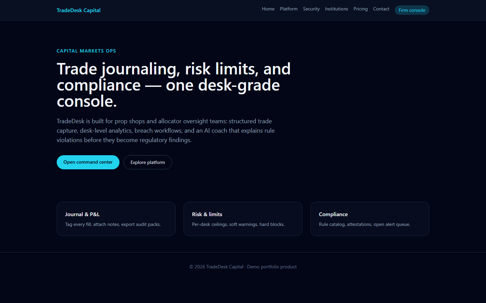
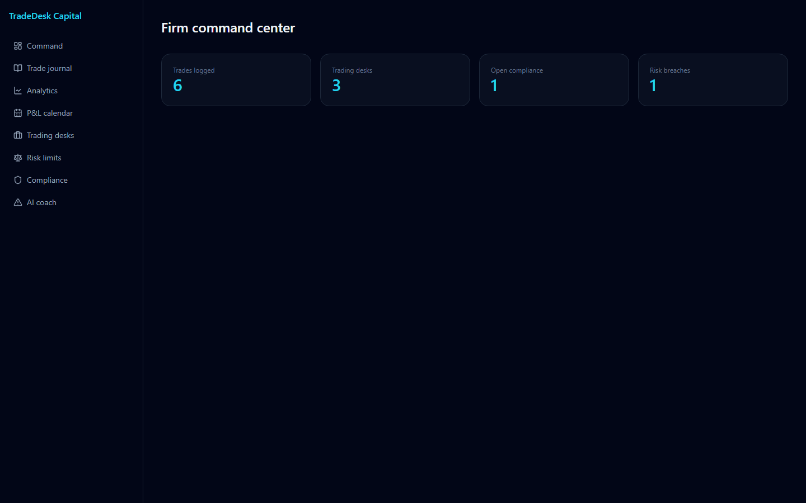
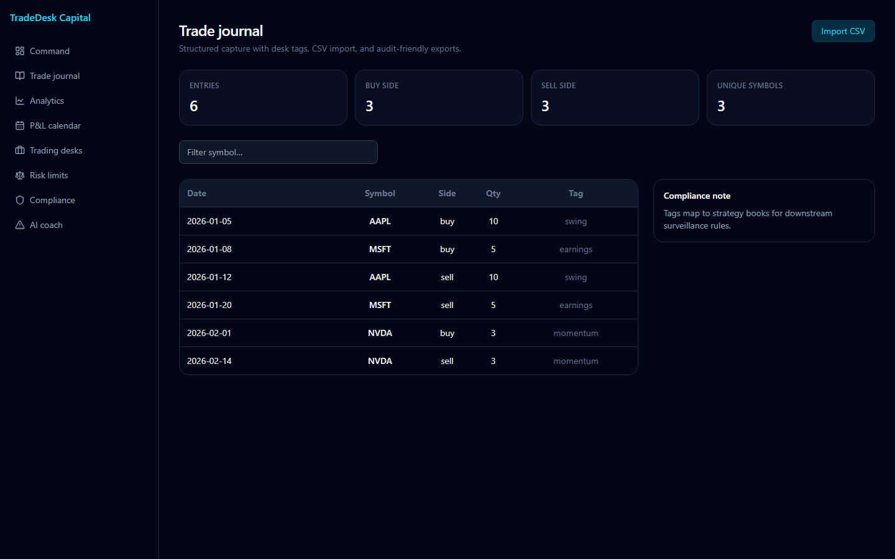
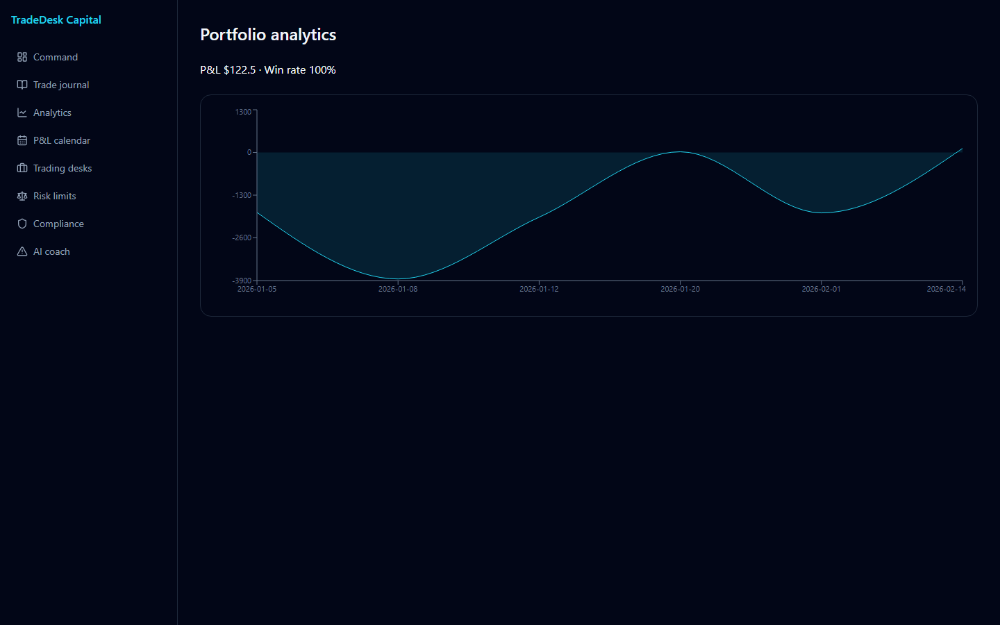
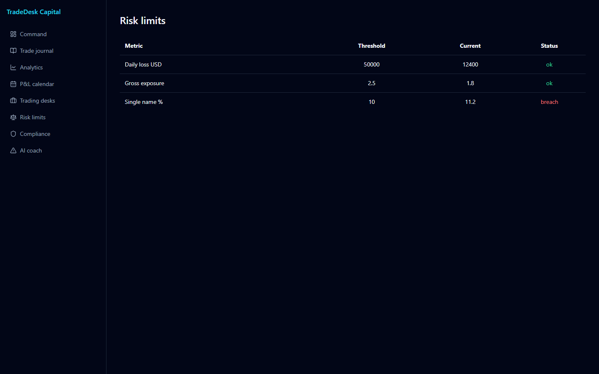

# TradeDesk — trade journal & desk console







NestJS API (SQLite via better-sqlite3) with a Vite + React console for a trade journal by **Alexsandro Sunaga**: CSV trade import, analytics and P&L calendar, trading desks and strategies, portfolios, risk limits, compliance alerts, and a rule-based coach that reviews recent trades.

## Console modules

http://localhost:3012/console

| Module | Route |
|--------|--------|
| Command | `/console` |
| Trade journal | `/console/journal` |
| Analytics | `/console/analytics` |
| P&L calendar | `/console/calendar` |
| Desks & books | `/console/desks` |
| Risk | `/console/risk` |
| Compliance | `/console/compliance` |
| Coach | `/console/coach` |

The public pages (`/`, `/features`, `/security`, `/institutions`, `/pricing`, `/contact`) are served by the same web app.

## Run

Setup (once):

```powershell
cd nest-api
npm install
cd ..\web
npm install
copy .env.example .env
```

Then from the repo root:

```powershell
.\run.ps1
```

`run.ps1` starts the NestJS API (`npm run start:dev`, port **8012**) in a new window, then the web app on port **3012** with `VITE_API_BASE=http://localhost:8012`.

The API stores data in `nest-api\data\journal.db`; delete it to re-seed desks, risk limits and compliance alerts.

## Demo login

`/login` posts to `POST /api/v1/auth/login` on the NestJS API. This is a demo-only endpoint (one account, in-memory tokens, no persistence):

- Email: `demo@tradedesk.dev`
- Password: `demo1234`

Override with the `DEMO_EMAIL` / `DEMO_PASSWORD` environment variables on the API. A successful login returns `{ "access_token": "...", "token_type": "bearer", "user": { ... } }` and the web app stores the token in `localStorage`. The console routes themselves are not gated in this demo.

## Tests

```powershell
cd nest-api
npm test
```

Uses Node's built-in test runner (`node:test`). It boots the real API on port 18012 with a throwaway data directory and checks health, demo login (success and 401), trade creation/listing and analytics.

## Author

**Alexsandro Sunaga**

## License

MIT License — see [LICENSE](LICENSE).
